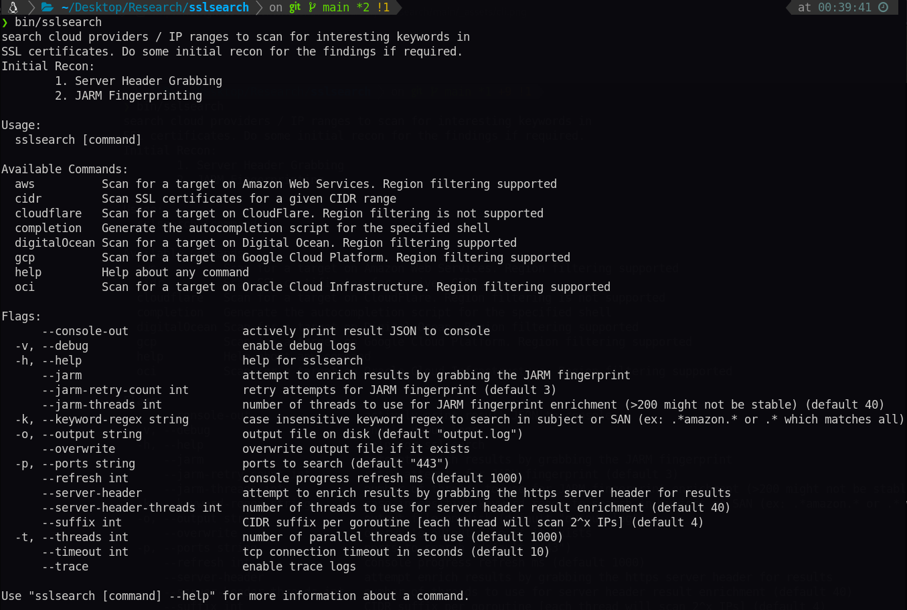

  # SSL Search
  
  Hunt SSL Certificates for interesting keywords on major cloud service providers.
  
  Details - https://medium.com/@harsh8v/ssl-search-a-tool-to-identify-infrastructure-and-discover-attack-surfaces-449c83269574
  
  ### Installation
  
  - install as a CLI tool for quick one-off scans
  ```bash
  git clone https://github.com/HarshVaragiya/sslsearch.git
  cd sslsearch
  go install
  ```
  
  - run as a docker container
  ```bash
  docker run ghcr.io/harshvaragiya/sslsearch:main
  ```
  
  ## Features
  - Search Cloud Service Providers IP Ranges / Given IP CIDR for keywords in SSL Certificate Subject / SANs
  - Perform JARM fingerprinting of https services identified
  - Grab all http response headers for webservers
  - Export integrations for Disk (local file), Elasticsearch, Cassandra / ScyllaDB
  
  More details about export targets at : [docs/Export.md](docs/Export.md)
  
  
  
  | Cloud Service Provider      | Region String Example | JARM | Server Header |
  | --------------------------- | --------------------- | ---- | ------------- |
  | Amazon Web Services         | us-east-1             | ✅   | ✅            |
  | Cloudflare                  | -                     | ✅   | ✅            |
  | Digital Ocean               | NL_NL-NH_Amsterdam    | ✅   | ✅            |
  | Google Cloud Platform       | us-west4              | ✅   | ✅            |
  | Oracle Cloud Infrastructure | ca-montreal-1         | ✅   | ✅            |
  | Raw CIDR / IP Range         | -                     | ✅   | ✅            |
  
  
  ## Potential uses
  1. Identifying Infrastructure / Attack Surface for a given scope.
  2. Bug Bounty recon.
  3. Scanning a whole CSP Region & Identifying Servers / Services of interest along with SSL certificate information.
  4. Scanning the whole Internet / Country's CIDRs & Collecting JARM fingerprints / Server Headers along with SSL certificate information.
  5. Finding Mail / RDP / Other services belonging to a target that use x509 certificates to secure connections.
  
  
  ## Future plans (not a roadmap)
  - [x] Export integrations for cassandra cluster
  - [x] Export integration for elasticsearch
  - [x] Grab all HTTPS server response headers
  - [x] Added profile guided optimization (PGO)
  - [x] Added background worker (job queueing) using redis
  - [x] Add k8s example deployments, with cronjob for scheduling tasks, executing them
  - [x] CI/CD Setup with docker image
  - [ ] Export integration to NATS
  - [ ] QOL - Split codebase into different packages like libexport, libscan for better code quality.
  - [ ] Certificate information like issuer, signature, chain etc to also be stored for analysis.
  - [ ] Integration tests with test docker containers??.
  
  
  ## References
  Ideated after following the following research projects :
  - https://github.com/jhaddix/awsScrape
  - https://github.com/femueller/cloud-ip-ranges
  - https://github.com/hdm/jarm-go
  - https://github.com/salesforce/jarm
